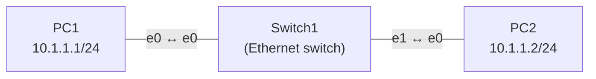
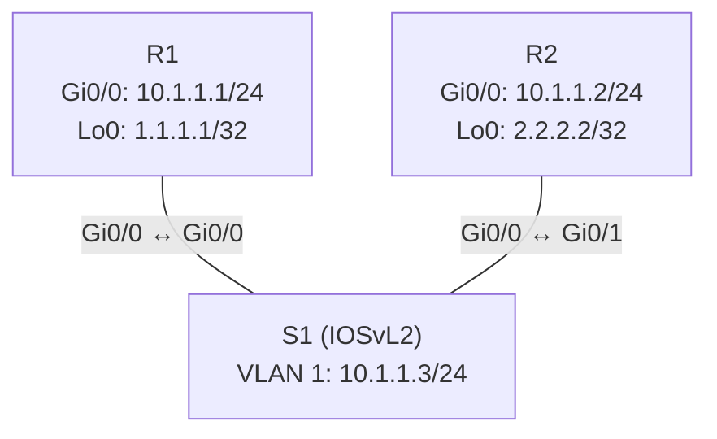

# Práctica 02 — Construcción de la red simulada en GNS3

| Campo | Detalle |
|-------|---------|
| **Asignatura** | Automatización de Infraestructura Digital I |
| **Práctica** | 2 de 12 |
| **Grupo** | 3IRI3V |
| **Fecha** | 25 de septiembre de 2026 |
| **Equipo** | Carlos Martin Cobos Hernandez, Erik Osiel Camarillo Espinoza y José Emilio Montes Villarreal |

## 🎯 Propósito

En esta práctica construimos una infraestructura de red virtual en **GNS3** que servirá como **laboratorio base del proyecto integrador**. Sobre esta red se probarán después los scripts de automatización que desarrollemos durante la asignatura.

El flujo de trabajo fue:

> Preparar el entorno → Construir la infraestructura → Configurar → Probar → Documentar

Se armaron dos topologías: una red básica de capa 2 con PCs virtuales y una red con routers Cisco y un switch multicapa que usa OSPF.

## 📁 Estructura de la carpeta

```
docs/practica-02/
├── README.md                  ← este archivo
├── topologia-01/
│   ├── topologia.jpeg
│   ├── configuracion.md
│   └── evidencias/
│       ├── evidencia_1.jpeg   ← configuración de PC1 y ping PC1 → PC2
│       └── evidencia_2.jpeg   ← configuración de PC2 y ping PC2 → PC1
└── topologia-02/
    ├── topologia.jpeg
    ├── configuracion.md
    └── evidencias/
        ├── evidencia_1.jpeg   ← configuración de S1 y show vlan brief
        ├── evidencia_2.jpeg   ← configuración de R1 (IP + OSPF) y vecino OSPF
        └── evidencia_3.jpeg   ← ping R1 → R2
```

---

## 🖧 Topología 01 — Primera red en GNS3 (PC–Switch–PC)


**Proyecto en GNS3:** `MiPrimeraTopologia`

Es la red más sencilla posible: dos computadoras virtuales (**VPCS**) conectadas a un **Ethernet switch** de GNS3. Todos los dispositivos se ejecutan en la **GNS3 VM**.



| Dispositivo | Tipo | Interfaz | Dirección IP | Máscara |
|-------------|------|----------|--------------|---------|
| PC1 | VPCS | e0 | 10.1.1.1 | 255.255.255.0 |
| PC2 | VPCS | e0 | 10.1.1.2 | 255.255.255.0 |
| Switch1 | Ethernet switch (GNS3) | e0, e1 | — | — |

**¿Qué demuestra?** Que dos equipos en la misma red (`10.1.1.0/24`) se comunican a través de un switch de capa 2 sin necesidad de un router. El ping exitoso en ambos sentidos confirma que los enlaces, el direccionamiento IP y el switch funcionan correctamente.

**Resultado:** ping PC1 → PC2 y PC2 → PC1 exitosos, 5 de 5 respuestas en cada sentido.

➡️ Configuración paso a paso y resultados: [`topologia-01/configuracion.md`](topologia-01/configuracion.md)

---

## 🌐 Topología 02 — Red de routers y switch multicapa


**Proyecto en GNS3:** `MiSegundaTopologia`

Red con dos routers **Cisco IOSv 15.9(3)M6** conectados a un switch multicapa **Cisco IOSvL2 15.2**. Cada router tiene una interfaz física hacia el switch y una **loopback** que funciona como identificador. Los routers intercambian rutas mediante **OSPF (proceso 1, área 0)**.



| Dispositivo | Imagen | Interfaz | Dirección IP | Máscara |
|-------------|--------|----------|--------------|---------|
| R1 | Cisco IOSv 15.9(3)M6 | Gi0/0 | 10.1.1.1 | 255.255.255.0 |
| R1 | | Loopback 0 | 1.1.1.1 | 255.255.255.255 |
| R2 | Cisco IOSv 15.9(3)M6 | Gi0/0 | 10.1.1.2 | 255.255.255.0 |
| R2 | | Loopback 0 | 2.2.2.2 | 255.255.255.255 |
| S1 | Cisco IOSvL2 15.2 | VLAN 1 (SVI) | 10.1.1.3 | 255.255.255.0 |

**¿Qué demuestra?** Que dos routers en el mismo segmento pueden comunicarse y, gracias a OSPF, **aprender automáticamente** las redes del otro (en este caso, la loopback del vecino). El switch multicapa conecta ambos routers y además tiene una IP de administración en la VLAN 1.

**Resultados:**

- Ping R1 → R2: **5/5 paquetes, 0 % de pérdida** (min/avg/max = 9/25/38 ms).
- Vecino OSPF: R1 ve a `2.2.2.2` en estado **FULL/BDR** por `GigabitEthernet0/0`.
- Tabla de enrutamiento de R1: redes conectadas `10.1.1.0/24` y `1.1.1.1/32`, ruta OSPF hacia `2.2.2.2/32` vía `10.1.1.2`.

➡️ Configuración paso a paso y resultados: [`topologia-02/configuracion.md`](topologia-02/configuracion.md)

---

## ⚖️ Diferencias entre las dos topologías

| Aspecto | Topología 01 | Topología 02 |
|---------|--------------|--------------|
| Dispositivos | 2 VPCS + Ethernet switch de GNS3 | 2 routers Cisco IOSv + switch multicapa Cisco IOSvL2 |
| Capa OSI principal | Capa 2 (conmutación) | Capa 2 y capa 3 (enrutamiento) |
| Configuración | Solo IP en cada PC (`ip`, `save`) | Hostname, interfaces, loopbacks, OSPF, SVI (Cisco IOS) |
| Enrutamiento | No aplica | Dinámico con OSPF |
| Cómo se guarda | `save` en VPCS | `write` en modo privilegiado (`enable`) |
| Tiempo de arranque | Inmediato | Varios minutos (arranque de Cisco IOS) |

## 🧾 Bitácora de problemas y soluciones

| Problema encontrado | Posible causa | Solución aplicada | Resultado |
|---------------------|---------------|-------------------|-----------|
| Al escribir `write` en el switch salió un error y buscaba un servidor (`Translating "write"...domain server`) | No habíamos entrado al modo `enable`, así que el comando no se reconoció | Escribimos `enable` y volvimos a configurar y guardar | Se guardó bien y el switch quedó configurado |
| GNS3 mostró el error *"Project must be stopped in order to export it"* | Quisimos duplicar el proyecto con la red encendida | Detener la topología antes de duplicar o exportar | Se pudo continuar con el trabajo |
| El switch aparecía como router | No escogimos bien el archivo: usamos la imagen del router en el switch | Importamos la imagen correcta (IOSvL2) para el switch | Ya se pudo hacer la práctica correctamente |

Además, notamos que la computadora iba muy cargada (la GNS3 VM llegó a ~99 % de CPU y el equipo anfitrión a ~96 % de RAM) y que los equipos Cisco tardaban varios minutos en arrancar.

## 🔗 Integración con el proyecto

**a) ¿Qué elementos de la red podrían automatizarse con Python?**
Los nombres de los equipos, las direcciones IP de los puertos, el encendido de los puertos, la configuración de OSPF y el guardado de los cambios.

**b) ¿Qué información de los dispositivos podría obtenerse mediante un script?**
El estado de los puertos, las direcciones IP, los vecinos OSPF, la tabla de rutas y los nombres de los equipos.

**c) ¿Qué configuraciones podrían modificarse automáticamente?**
Las direcciones IP, los nombres de los equipos, la configuración de OSPF y las VLAN del switch. También se podría guardar la configuración en todos los equipos al mismo tiempo.

**d) ¿Por qué es importante contar con una red de laboratorio antes de automatizar dispositivos reales?**
Porque un error en un script puede dejar sin servicio a toda una red. En el laboratorio se puede probar y equivocarse sin riesgo, y cuando todo funciona se pasa a los equipos reales con más seguridad.

**e) ¿Cómo podría utilizarse esta infraestructura para probar los programas de las siguientes prácticas?**
Sirve como una red de práctica donde podemos correr los scripts, ver si hacen lo que queremos y corregirlos. Si algo sale mal, se reinicia la topología y se vuelve a intentar.

## 📝 Conclusiones

En esta práctica aprendimos a usar GNS3 para armar redes virtuales, conectar equipos, configurarlos y probarlos. La primera topología fue más sencilla porque solo tenía dos computadoras y un switch. La segunda fue más completa porque usó routers y un switch multicapa, con direcciones IP y OSPF.

Tuvimos algunas dificultades, como el error al guardar en el switch por no entrar al modo `enable` y el aviso al duplicar el proyecto encendido. Las resolvimos entrando al modo correcto y deteniendo la red antes de duplicar.

Aprendimos que sin una buena configuración y sin conectividad los dispositivos no se pueden comunicar. Esta red nos servirá después como laboratorio para probar los scripts de automatización del proyecto.

## 📚 Bibliografía

- Guía de la Práctica 2 de Automatización de Infraestructura Digital I: *Construcción de la red simulada en GNS3*.
