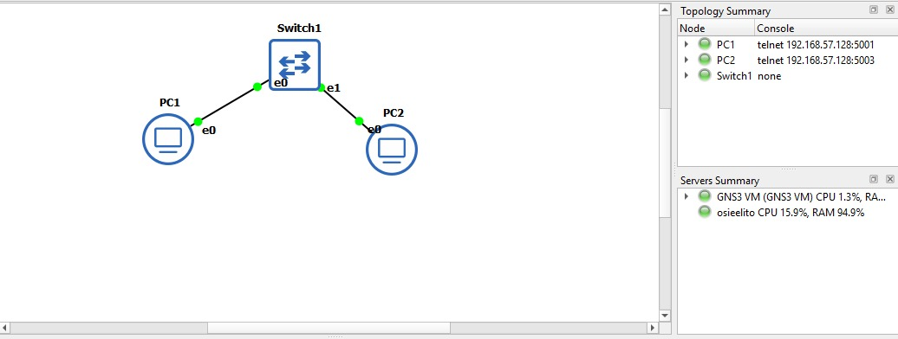
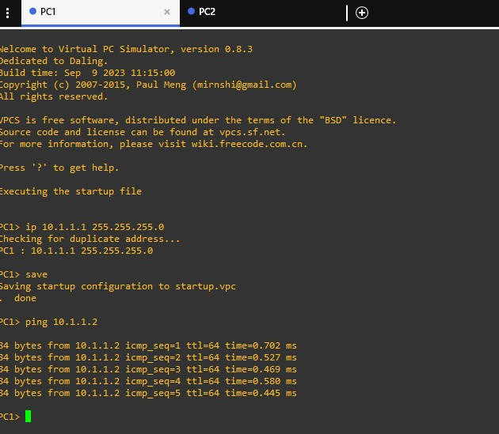
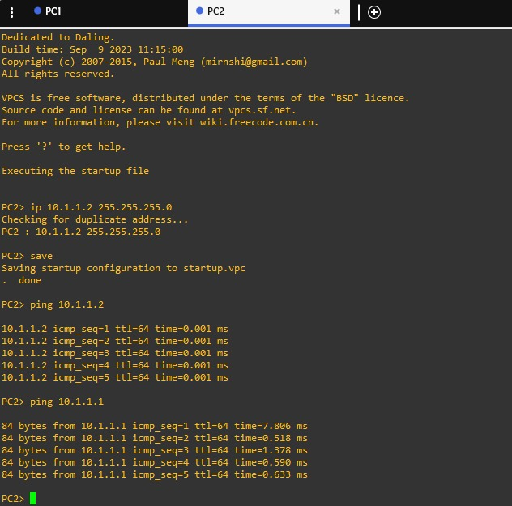

# Topología 01 — Configuración (PC–Switch–PC)

**Proyecto en GNS3:** `MiPrimeraTopologia`
**Servidor de ejecución:** GNS3 VM



## 1. Dispositivos

| Nombre | Tipo en GNS3 | Categoría | Símbolo |
|--------|--------------|-----------|---------|
| PC1 | VPCS | Browse End Devices | `client` (Affinity-circle-blue) |
| PC2 | VPCS | Browse End Devices | `client` (Affinity-circle-blue) |
| Switch1 | Ethernet switch | Browse Switches | switch (Affinity-square-blue) |

## 2. Cableado

| Origen | Interfaz | Destino | Interfaz |
|--------|----------|---------|----------|
| PC1 | Ethernet0 (e0) | Switch1 | Ethernet0 (e0) |
| Switch1 | Ethernet1 (e1) | PC2 | Ethernet0 (e0) |

## 3. Direccionamiento IP

| Dispositivo | Interfaz | Dirección IP | Máscara | Red |
|-------------|----------|--------------|---------|-----|
| PC1 | e0 | 10.1.1.1 | 255.255.255.0 | 10.1.1.0/24 |
| PC2 | e0 | 10.1.1.2 | 255.255.255.0 | 10.1.1.0/24 |

El switch no lleva dirección IP: el Ethernet switch de GNS3 solo conmuta tramas en capa 2.

## 4. Construcción en GNS3

1. Abrir GNS3 GUI y esperar a que en **Servers Summary** aparezcan en verde el servidor local y la GNS3 VM.
2. Crear un proyecto nuevo llamado `MiPrimeraTopologia`.
3. Desde **Browse Switches**, arrastrar un **Ethernet switch** al área de trabajo y elegir **GNS3 VM** como servidor.
4. Desde **Browse End Devices**, arrastrar dos **VPCS**.
5. Con **Add a link**, conectar PC1 e0 → Switch1 e0 y Switch1 e1 → PC2 e0. Presionar `Esc` para soltar la herramienta.
6. Activar **Show/Hide interface labels** y cambiar los símbolos con **Change symbol**.
7. Ajustar la vista con **View → Fit in view**.
8. Iniciar todos los nodos con **Start/Resume all nodes** y confirmar. Los leds de los enlaces cambian a verde.

## 5. Configuración de los dispositivos

Se abre la consola de cada PC (clic derecho → **Console**).

### PC1

```
PC1> ip 10.1.1.1 255.255.255.0
PC1> save
```

### PC2

```
PC2> ip 10.1.1.2 255.255.255.0
PC2> save
```

| Comando | Función |
|---------|---------|
| `ip <dirección> <máscara>` | Asigna la dirección IP y la máscara a la interfaz de la VPCS. Antes de aplicarla, VPCS revisa que no haya una dirección duplicada. |
| `save` | Guarda la configuración en `startup.vpc`. En GNS3 las configuraciones **no se guardan solas** (a diferencia de Packet Tracer), por eso hay que ejecutarlo. |

## 6. Pruebas de conectividad

### Ping PC1 → PC2

```
PC1> ping 10.1.1.2
```

| Secuencia | TTL | Tiempo |
|-----------|-----|--------|
| 1 | 64 | 0.702 ms |
| 2 | 64 | 0.527 ms |
| 3 | 64 | 0.469 ms |
| 4 | 64 | 0.580 ms |
| 5 | 64 | 0.445 ms |

**Resultado:** exitoso, 5 de 5 respuestas.

### Ping PC2 → PC1

```
PC2> ping 10.1.1.1
```

| Secuencia | TTL | Tiempo |
|-----------|-----|--------|
| 1 | 64 | 7.806 ms |
| 2 | 64 | 0.518 ms |
| 3 | 64 | 1.378 ms |
| 4 | 64 | 0.590 ms |
| 5 | 64 | 0.633 ms |

**Resultado:** exitoso, 5 de 5 respuestas. El primer paquete tarda más (7.806 ms), probablemente por la resolución ARP de la dirección MAC de PC1; los siguientes ya responden en menos de 1.5 ms.

Antes de este ping, PC2 también hizo un ping a su propia dirección (`ping 10.1.1.2`) para confirmar que su interfaz estaba configurada.

### Resumen

| Prueba | Resultado | Evidencia |
|--------|-----------|-----------|
| Topología completa | Nodos encendidos, enlaces en verde | [`topologia.jpeg`](topologia.jpeg) |
| Configuración de PC1 | `10.1.1.1/24` aplicada y guardada | [`evidencia_1.jpeg`](evidencias/evidencia_1.jpeg) |
| Configuración de PC2 | `10.1.1.2/24` aplicada y guardada | [`evidencia_2.jpeg`](evidencias/evidencia_2.jpeg) |
| Ping PC1 → PC2 | Exitoso, 5/5 | [`evidencia_1.jpeg`](evidencias/evidencia_1.jpeg) |
| Ping PC2 → PC1 | Exitoso, 5/5 | [`evidencia_2.jpeg`](evidencias/evidencia_2.jpeg) |

## 7. Pregunta de análisis

**¿Qué demuestra que el ping sea exitoso entre PC1 y PC2?**

Demuestra que las dos computadoras se pueden comunicar. Los mensajes salieron de una, pasaron por el switch, llegaron a la otra y también regresaron. Eso quiere decir que los cables, las direcciones IP y el switch están bien.

## 8. Cierre

Al terminar, se detiene la topología con **Stop all nodes** y se confirma.

## 9. Evidencias

**Topología completa:** PC1, PC2 y Switch1 con los enlaces activos; en *Servers Summary* aparecen en verde la GNS3 VM y el servidor local.


**Evidencia 1 — PC1:** se asigna `10.1.1.1/24`, se guarda y se hace ping a PC2.



**Evidencia 2 — PC2:** se asigna `10.1.1.2/24`, se guarda, se prueba la propia dirección y se hace ping a PC1.


