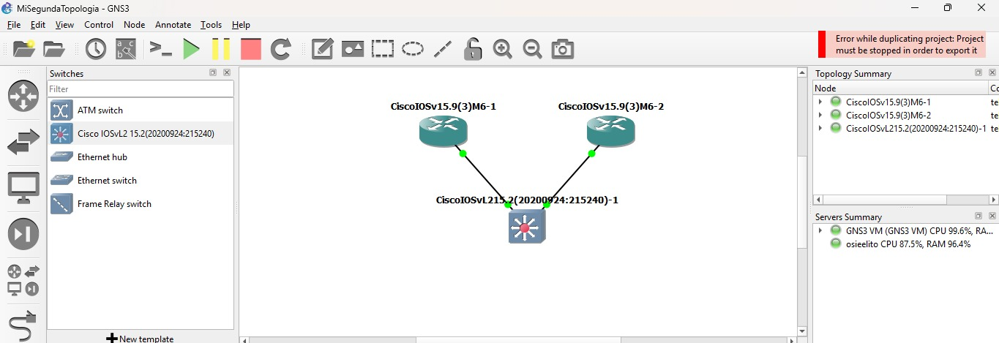
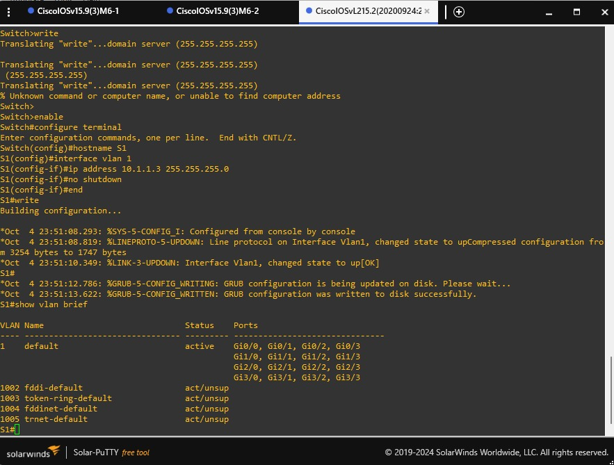
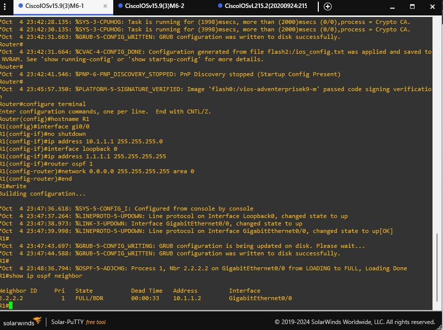
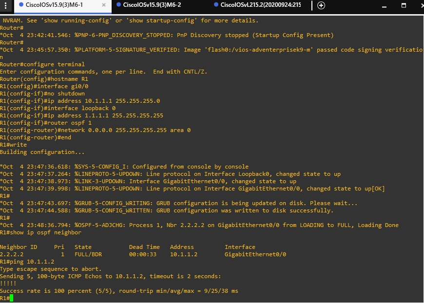

# Topología 02 — Configuración (routers y switch multicapa)

**Proyecto en GNS3:** `MiSegundaTopologia`
**Servidor de ejecución:** GNS3 VM



## 1. Imágenes Cisco requeridas

Antes de armar la topología se importaron en GNS3 dos imágenes de Cisco VIRL en formato `.qcow2`:

| Imagen | Uso | Dónde se importa |
|--------|-----|------------------|
| Cisco IOSv 15.9(3)M6 | Routers | Browse Routers → New template |
| Cisco IOSvL2 15.2 (20200924) | Switch multicapa | Browse Switches → New template |

Proceso para IOSv (IOSvL2 es igual, pero desde **Browse Switches**):

1. **Browse Routers** → **New template**.
2. Elegir **Install an appliance from the GNS3 server (recommended)** → **Next**.
3. Expandir **Routers**, seleccionar **Cisco IOSv** → **Install**.
4. Dejar **Install the appliance on the GNS3 VM** → **Next**.
5. No cambiar el binario de QEMU → **Next**.
6. GNS3 detecta la imagen descargada; falta el archivo `IOSv_startup_config.img`.
7. Seleccionar ese archivo y pulsar **Download**; se descarga desde el navegador.
8. De vuelta en GNS3, pulsar **Refresh** → **Next**.
9. Pulsar **Install** y esperar a que termine.

## 2. Dispositivos

| Hostname | Nombre en GNS3 | Imagen | Rol |
|----------|----------------|--------|-----|
| R1 | CiscoIOSv15.9(3)M6-1 | Cisco IOSv 15.9(3)M6 | Router |
| R2 | CiscoIOSv15.9(3)M6-2 | Cisco IOSv 15.9(3)M6 | Router |
| S1 | CiscoIOSvL215.2(20200924:215240)-1 | Cisco IOSvL2 15.2 | Switch multicapa |

## 3. Cableado

| Origen | Interfaz | Destino | Interfaz |
|--------|----------|---------|----------|
| R1 | GigabitEthernet0/0 | S1 | GigabitEthernet0/0 |
| R2 | GigabitEthernet0/0 | S1 | GigabitEthernet0/1 |

## 4. Direccionamiento IP

| Dispositivo | Interfaz | Dirección IP | Máscara | Red |
|-------------|----------|--------------|---------|-----|
| R1 | Gi0/0 | 10.1.1.1 | 255.255.255.0 | 10.1.1.0/24 |
| R1 | Loopback 0 | 1.1.1.1 | 255.255.255.255 | 1.1.1.1/32 |
| R2 | Gi0/0 | 10.1.1.2 | 255.255.255.0 | 10.1.1.0/24 |
| R2 | Loopback 0 | 2.2.2.2 | 255.255.255.255 | 2.2.2.2/32 |
| S1 | VLAN 1 (SVI) | 10.1.1.3 | 255.255.255.0 | 10.1.1.0/24 |

## 5. Construcción en GNS3

1. **File → New blank project** con el nombre `MiSegundaTopologia`.
2. Agregar un switch **Cisco IOSvL2** y dos routers **Cisco IOSv**.
3. Cablear R1 Gi0/0 → S1 Gi0/0 y R2 Gi0/0 → S1 Gi0/1.
4. Personalizar símbolos, mostrar las etiquetas de las interfaces y ajustar la vista.
5. Iniciar la topología y abrir la consola de los tres equipos. Cisco IOS tarda **varios minutos** en arrancar antes de aceptar comandos.

## 6. Configuración de R1

```
Router#configure terminal
Router(config)#hostname R1
R1(config)#interface gi0/0
R1(config-if)#no shutdown
R1(config-if)#ip address 10.1.1.1 255.255.255.0
R1(config-if)#interface loopback 0
R1(config-if)#ip address 1.1.1.1 255.255.255.255
R1(config-if)#end
R1#show ip interface brief
R1#write
```

### Explicación de los comandos

| Comandos | Función |
|----------|---------|
| `configure terminal` y `hostname R1` | Entran a la configuración del router y le ponen el nombre R1 para reconocerlo fácil. |
| `interface gi0/0`, `no shutdown` e `ip address 10.1.1.1 255.255.255.0` | Eligen el puerto que va al switch, lo encienden y le dan su dirección. |
| `interface loopback 0` e `ip address 1.1.1.1 255.255.255.255` | Crean un puerto virtual con su propia dirección. Siempre está encendido y sirve como identificador del router. |
| `end` y `show ip interface brief` | Salen de la configuración y muestran un resumen de los puertos con su dirección y su estado. |
| `write` | Guarda los cambios para que no se pierdan al reiniciar. |

## 7. Configuración de R2

```
Router#configure terminal
Router(config)#hostname R2
R2(config)#interface gi0/0
R2(config-if)#no shutdown
R2(config-if)#ip address 10.1.1.2 255.255.255.0
R2(config-if)#interface loopback 0
R2(config-if)#ip address 2.2.2.2 255.255.255.255
R2(config-if)#end
R2#show ip interface brief
R2#write
```

Son los mismos comandos que en R1. Solo cambian el nombre a **R2**, la dirección del puerto a **10.1.1.2** y la dirección del puerto virtual a **2.2.2.2**. Así los dos routers quedan en la misma red y se pueden comunicar.

## 8. Configuración de OSPF (R1 y R2)

Se ejecuta **exactamente igual** en ambos routers:

```
R1#configure terminal
R1(config)#router ospf 1
R1(config-router)#network 0.0.0.0 255.255.255.255 area 0
R1(config-router)#end
R1#write
```

| Comando | Función |
|---------|---------|
| `router ospf 1` | Activa OSPF con el número de proceso 1 (es local al router). |
| `network 0.0.0.0 255.255.255.255 area 0` | La máscara wildcard `255.255.255.255` coincide con cualquier dirección, así que **todas las interfaces** (Gi0/0 y Loopback 0) participan en OSPF dentro del área 0. |

Como no se configuró un `router-id` manual, cada router toma como identificador la IP de su loopback: R1 = `1.1.1.1` y R2 = `2.2.2.2`.

## 9. Configuración de S1

```
Switch>enable
Switch#configure terminal
Switch(config)#hostname S1
S1(config)#interface vlan 1
S1(config-if)#ip address 10.1.1.3 255.255.255.0
S1(config-if)#no shutdown
S1(config-if)#end
S1#write
```

| Comandos | Función |
|----------|---------|
| `enable` | Entra al modo privilegiado. Sin él, `write` no se reconoce (ver bitácora). |
| `hostname S1` | Le pone el nombre S1 al switch. |
| `interface vlan 1`, `ip address 10.1.1.3 ...` y `no shutdown` | Crean la interfaz virtual (SVI) de la VLAN 1, le asignan una IP de administración y la encienden. |
| `write` | Guarda la configuración. En routers y switches se recomienda ejecutarlo varias veces si se hacen varios cambios. |

Con `show vlan brief` se verificó que todos los puertos del switch (Gi0/0–Gi3/3) pertenecen a la **VLAN 1 (default)**, por lo que R1 y R2 quedan en el mismo dominio de broadcast.

## 10. Verificación

### Ping R1 → R2

```
R1#ping 10.1.1.2
Type escape sequence to abort.
Sending 5, 100-byte ICMP Echos to 10.1.1.2, timeout is 2 seconds:
!!!!!
Success rate is 100 percent (5/5), round-trip min/avg/max = 9/25/38 ms
```

| Dato | Valor |
|------|-------|
| Resultado | Exitoso |
| Paquetes enviados | 5 |
| Paquetes recibidos | 5 |
| Porcentaje de pérdida | 0 % |
| Tiempo (min/avg/max) | 9 / 25 / 38 ms |

### Vecinos OSPF

```
R1#show ip ospf neighbor

Neighbor ID     Pri   State           Dead Time   Address         Interface
2.2.2.2           1   FULL/BDR        00:00:33    10.1.1.2        GigabitEthernet0/0
```

En la consola también aparece el mensaje que confirma la adyacencia:

```
%OSPF-5-ADJCHG: Process 1, Nbr 2.2.2.2 on GigabitEthernet0/0 from LOADING to FULL, Loading Done
```

R1 ve como vecino al router `2.2.2.2` (R2) en estado **FULL**, con dirección `10.1.1.2`, por el puerto `GigabitEthernet0/0`. `BDR` indica que R2 es el router designado de respaldo en el segmento.

**Pregunta de análisis: ¿Qué información proporciona `show ip ospf neighbor` y qué indicaría que la relación se estableció correctamente?**

Muestra la lista de los routers vecinos con los que el router se está comunicando por OSPF: el ID del vecino, su prioridad, su estado, la dirección y el puerto por donde se conectan. La relación quedó bien cuando el estado dice **FULL**. En nuestro caso R1 ve a `2.2.2.2` en estado FULL por `GigabitEthernet0/0`, así que los dos routers ya comparten sus rutas.

### Tabla de enrutamiento de R1

```
R1#show ip route
```

Según la configuración, la tabla de R1 contiene:

| Tipo | Red | Interfaz / siguiente salto |
|------|-----|----------------------------|
| Conectada (`C`) | 10.1.1.0/24 | GigabitEthernet0/0 |
| Conectada (`C`) | 1.1.1.1/32 | Loopback0 |
| Aprendida por OSPF (`O`) | 2.2.2.2/32 | vía 10.1.1.2 (R2), GigabitEthernet0/0 |

- **Redes conectadas:** `10.1.1.0/24` (Gi0/0) y `1.1.1.1/32` (loopback).
- **Rutas aprendidas:** `2.2.2.2/32`, que llega desde R2 por `10.1.1.2`.
- **Rutas relacionadas con OSPF:** la misma `2.2.2.2/32`.

La tabla de enrutamiento es como un mapa que el router consulta para saber por dónde mandar cada paquete. Dice qué redes conoce, cuáles están conectadas directamente y cuáles aprendió de otros routers, y por qué puerto o vecino debe enviar el tráfico.

## 11. Pruebas finales

| Prueba | Resultado | Evidencia |
|--------|-----------|-----------|
| R1 → R2 | Exitoso, 5 de 5 paquetes recibidos | [`evidencia_3.jpeg`](evidencias/evidencia_3.jpeg) |
| R2 → R1 | Hay comunicación en los dos sentidos porque el vecino OSPF está en FULL | [`evidencia_2.jpeg`](evidencias/evidencia_2.jpeg) |
| Estado de interfaces | Gi0/0 y Loopback 0 arriba y funcionando | [`evidencia_2.jpeg`](evidencias/evidencia_2.jpeg) (mensajes `%LINK-3-UPDOWN` / `%LINEPROTO-5-UPDOWN`) |
| Vecino OSPF | R1 ve a 2.2.2.2 en estado FULL | [`evidencia_2.jpeg`](evidencias/evidencia_2.jpeg) |
| Tabla de enrutamiento | Redes conectadas y ruta OSPF hacia 2.2.2.2 | Configuración de OSPF en los routers |
| Switch S1 | VLAN 1 con IP 10.1.1.3 y todos los puertos asignados | [`evidencia_1.jpeg`](evidencias/evidencia_1.jpeg) |

Al terminar, se detiene la topología antes de cerrar GNS3.

## 12. Evidencias

**Topología completa:** dos routers Cisco IOSv conectados al switch IOSvL2, todos encendidos. Arriba a la derecha se ve el aviso *"Project must be stopped in order to export it"* registrado en la bitácora.


**Evidencia 1 — S1:** primer intento de `write` sin `enable` (error), después la configuración correcta del hostname y la VLAN 1, el guardado y `show vlan brief`.



**Evidencia 2 — R1:** hostname, IP en Gi0/0, loopback 0, OSPF, guardado y `show ip ospf neighbor` con R2 en estado FULL.



**Evidencia 3 — Ping R1 → R2:** 5 de 5 paquetes recibidos, 0 % de pérdida.


